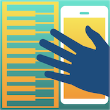

# MIDI Gestures - supercharge your controller

MIDI Gestures lets you alter the output of a connected MIDI keyboard on the fly using full-screen multi-touch gestures. Swipe through dozens of standard GM 2 software instruments. Pinch to apply pitch bend, tap to lock the damper pedal (sustain) or pan to operate the virtual modulation wheel. If there's no controller available you can still try out all the effects on a test music sequence like stereo pan, master gain and global tuning. MIDI Gestures is the best companion for your keys.

[Download on the App Store](https://itunes.apple.com/us/app/midi-gestures-supercharge-your-controller/id1258753909?ls=1&mt=8)
